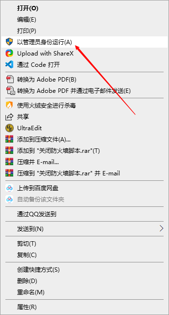

[TOC]

# 固定站装机指南（20.11.06）

## 1 软件安装

### 1.1 串口服务器软件安装

在装机目录中双击 ZLVircom4.96_x86.msi 进行安装（主副屏都需要安装）

### 1.2 数据同步软件安装

在安装目录中双击 SyncBackPro_Setup.exe 进行安装（在主屏安装即可），输入注册码，即可安装完成，注册机有些杀毒软件会误报，可以使用以下安装密钥

安装密钥：

**SBPR4FL675-2347-L5A9-6DF7-E98N-T105
SBPR4FL513-PL46-W50W-B1B5-6A4K-XV1V
SBPR4FL738-65KF-F36D-PXBQ-3G01-MBX1
SBPR4FL718-540L-HKGT-PQ0P-3875-XK3M
SBPR4FL633-6DFP-93JR-48M0-FPSQ-2040
SBPR4FL737-48G0-8002-X0BC-X4RE-QDFE
SBPR4FL544-4VR4-4YVA-L410-5DN0-250F
SBPR4FL500-3K7H-SBDM-0L41-HEHF-13N6
SBPR4FL823-DGMG-05C0-SB2K-220W-14RH**

如果安装没输入，也可以在下次运行时在如下界面输入

### 1.3 局域网共享软件安装

**局域网共享精灵V10.6.EXE**

此软件为绿色安装拷贝至D盘即可(以**管理员模式**运行)，此软件可能引起杀毒软件误报。

### 1.4 防火墙软件安装

在装机工具文件夹中找到 **添加防火墙规则.bat** 并右键以管理员模式运行，关闭防火墙

## 2 配置

### 2.1 工控机IP设置

为了消除IP冲突提醒，请把IPV6取消

#### 2.1.1 主机IP如下设置

#### 2.1.2 副屏IP如下设置

### 2.2 串口服务器配置

#### 2.2.1 通用设置

按以下参数进行配置

192.168.1.200/201/202/203/204/205/207按如下进行设置

#### 2.2.2 特殊设置

**192.168.1.206** 按如下进行设置

其中**192.168.1.206/207**还需要进行如下设置，其他通道可不设置

### 2.3 局域网共享配置

* **请以管理员模式运行该软件**
* **此软件可能引起杀毒软件误报，杀毒软件如有询问，可点击允许通过**

#### 2.3.1 主屏设置

添加 **我的文档/database** 为共享文件夹

#### 2.3.2 副屏设置

添加 **D盘** 为共享文件夹

第一次打开按如下设置

添加共享文件夹

添加共享文件夹

### 2.3 SyncbackPro配置

**此设置只要在主屏设置即可**

#### 2.3.1 导入任务项

在导出/导入菜单下选择导入任务设置，导入装机工具中的配置文件Sync.sps

#### 2.3.2 全局设置

设置如下：

### 2.4 防火墙设置

参考1.4

### 2.5 各模块配置项

#### 2.5.1 连接设置

| 模块         | 连接端口      |      |
| ------------ | ------------- | ---- |
| 采配水       | 192.168.1.200 |      |
| 高锰酸盐指数 | 192.168.1.201 |      |
| 氨氮         | 192.168.1.202 |      |
| 总磷         | 192.168.1.203 |      |
| 总氮         | 192.168.1.204 |      |
| 化学需氧量   | 192.168.1.205 |      |
| 多参数       | 192.168.1.206 |      |
| 加标回收     | 192.168.1.207 |      |
| 超标留样     | COM1          |      |
|              |               |      |

#### 2.5.2 加标回收参数

| 监测参数     | 量程 | 检出限 | 定容体积         | 母液浓度         |      |
| ------------ | ---- | ------ | ---------------- | ---------------- | ---- |
| 氨氮         | 1.2  | 0.04   | 根据实际情况填写 | 根据实际情况填写 |      |
| 总磷         | 1.2  | 0.01   | 根据实际情况填写 | 根据实际情况填写 |      |
| 总氮         | 10   | 0.1    | 根据实际情况填写 | 根据实际情况填写 |      |
| 高锰酸盐指数 | 20   | 0.5    | 根据实际情况填写 | 根据实际情况填写 |      |

